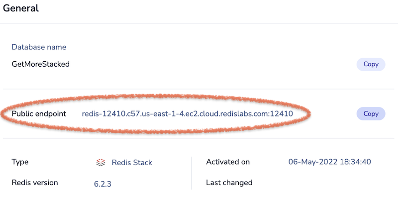
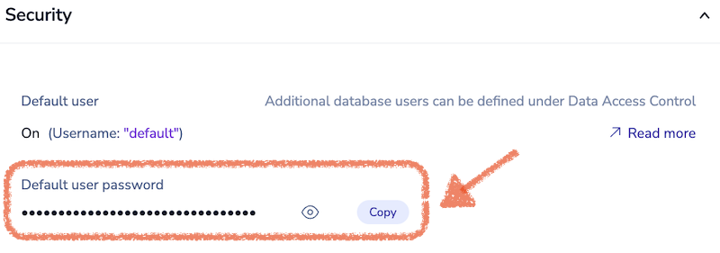
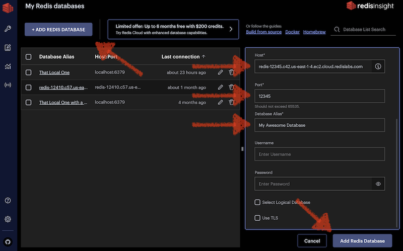
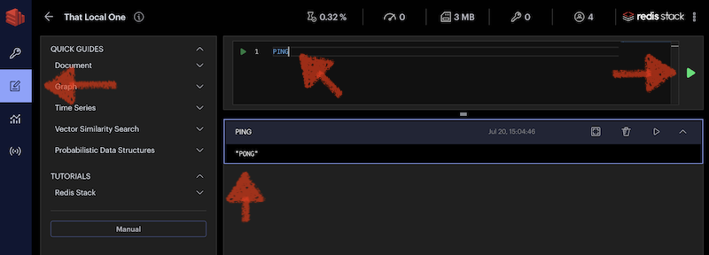

# Installing Redis Stack & RedisInsight

We'll be using [Redis Stack](https://redis.io/docs/stack/) for our flavor of Redis. Redis Stack includes the OSS Redis that you know and love plus several modules that extend it's capabilities. More on modules later.

We'll also be using [RedisInsight](https://redis.io/docs/stack/insight/) which is a graphical client for Redis. We'll use it to issue commands and browse our database.

For this workshop, there are two ways you can install Redis Stack and RedisInsight. Pick the one you like:


## Use Redis Cloud (i.e. don't install it) ##

**Pros**:
  - No need to install Redis Stack. You just use it.
  - The $200 credit you get by using code STACK200.

**Cons**:
  - Depends on the network and we're at a conference.
  - Doesn't include RedisInsight so you need to install that yourself.
  - The free database is limited to 30 megs—but you have $200 to spend!

### Installing Using Redis Cloud ###

- [ ] Sign up for Redis Cloud at https://redis.com/try-free/.

- [ ] Create a free subscription and create a database, following the on screen instructions.

- [ ] Make a note of your _public endpoint_ and you _password_ for your database. Your endpoint will be something like `redis-12345.c42.us-east-1-4.ec2.cloud.redislabs.com:12345`, it's a hostname and port. Your password is, well, a password. Keep it secret. Keep it safe.





- [ ] If you want to enter your coupon code (STACK200) do so under Billing & Payments. Note that you will need a credit card to do this.

- [ ] Download and install RedisInsight from https://redis.com/redis-enterprise/redis-insight/. Yes, it does ask for a lot of information. Once installed, run it.



- [ ] Click the big **ADD REDIS DATABASE** button.

- [ ]  Enter your hostname and port. Give you database an alias (i.e. a name). Enter your pasword. Leave username blank. Then click **Add Redis Database**.

- [ ]  Now just click your database from the list and you can start browsing and issuing commands.


## Use the Docker Image (i.e. let Docker install it) ##

**Pros**:
  - No network. No problems.
  - Mo database limits on _my_ machine.
  - Docker image has RedisInsight already installed.

**Cons**:
  - Assumes you have Docker.
  - Installing Docker images over conference WiFi is just as risky.
  - Can't take advantage of the $200 credit by using the code STACK200.

### Installing Using Docker ###

Installing with Docker is pretty easy. Just run the following command:

```
docker run -d --name redis-stack -p 6379:6379 -p 8001:8001 redis/redis-stack:latest
```

And that's it. You now have Redis Stack installed and running. *And* you now have RedisInsight running too. To use it, just point your browser at http://localhost:8001 and browse your database.

## Running You First Command ##

Let's confirm that the installation of Redis Stack is working by entering our first command from RedisInsight.

- [ ] Select workbench on the left naviagtion bar to access the command-line console.

- [ ] Enter `PING` into the console and click the play button.

- [ ] Observe the `PONG` in response.



## Next Steps

I'm gonna be giving you a lot of Redis commands. Don't expect screenshots all the time, as they're kind of a pain for me make and hard for you to copy and paste from. So, instead, future command-line examples will often be presented in the following format:

```
127.0.0.1:6379> PING
PONG
127.0.0.1:6379>
```

This is the format used by `redis-cli`, the command-line client that ships with OSS Redis.

And that's it. Now, let's start looking at some [data structures](DATA-STRUCTURES.md).
